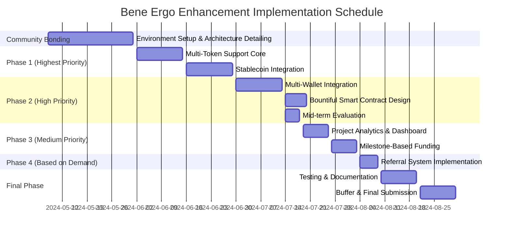

# Google Summer of Code 2025

## Project Proposal - BenefactionPlatform-Ergo: Expanding Fundraising Capabilities on Ergo

### Contact Information
Name: [Aditya Gupta]

Email: [aditya.gupta20871@gmail.com]

GitHub: [https://github.com/AdityaGupta20871]

LinkedIn: [https://www.linkedin.com/in/aditya-gupta-732857233/]

Discord: [Aditya_Gupta]

### Education
College Name: [Maharaja Agrasen Institute of Technology]

Degree: [B.Tech in Computer Science and Engineering]

Expected Graduation Year: [2025]

CGPA/GPA: [8.656]

### Commitment
**How many hours will you work per week on your GSoC project?**
I anticipate being able to dedicate approximately 35-40 hours per week to this project during the GSoC period.

**Do you have any commitments during the GSoC Period?**
[I currently have no major commitments that would interfere with my GSoC participation. While I am preparing for the GRE to pursue graduate studies in research abroad, I can fully commit to the GSoC schedule. If selected, I would prioritize this opportunity as it aligns perfectly with my research aspirations and would be an invaluable addition to my academic profile.]

## Chosen Project: BenefactionPlatform-Ergo - Multi-Token Support and EVM Feature Parity

### 1. Introduction: Enhancing Ergo's Fundraising Ecosystem

The Bene Fundraising Platform on Ergo blockchain provides a unique proof-of-funding mechanism through the APT/PFT token system, enabling transparent project funding. While the EVM version of Bene supports multiple wallets, networks, and token types, the Ergo implementation currently has limitations. This proposal aims to enhance the Ergo version of Bene by implementing multi-token support (especially stablecoins) and achieving greater feature parity with the EVM version while considering specific Ergo-specific needs and capabilities.

### 2. Technical Gap Analysis

Based on an analysis of the codebase and Bruno's vision, I've identified the following key areas for improvement in order of priority:

1. **Limited Token Support**: Currently, the Ergo implementation only supports ERG for contributions, while the EVM version supports multiple tokens including stablecoins.
2. **Wallet Integration Framework**: Need for a comprehensive multi-wallet integration system similar to the EVM version.
3. **Referral System**: Implementation of a referral mechanism to incentivize project marketing while preventing exploitation.
4. **Auxiliary Exchange Functionality**: Enhanced token exchange capabilities between APTs and PFTs.
5. **Analytics Dashboard**: Development of project performance tracking and visualization tools.
6. **Platform Unification**: Reducing fragmentation between EVM and Ergo implementations to minimize duplicate development efforts.
7. **Bounty Platform Integration**: Potential to incorporate elements from the Bountiful proposal for decentralized bounty management.


## 3. Proposed Technical Implementations

To address these gaps and align with Bruno's vision, I propose implementing the following features in priority order:

### 3.1 Multi-Token Support With Emphasis on Stablecoins

**Technical Challenge:** The current contract design primarily handles ERG as the contribution currency.

**Innovative Solution:** Extend the smart contract to support contributions using other Ergo tokens, with a special focus on stablecoins within the Ergo ecosystem.

**Technical Implementation:**
1. Modify the existing contract to handle multiple token types:
   ```ergoscript
   // Snippet showing multi-token handling in contract
   {
     // Extract token info from input box
     val contributionTokenId = INPUTS(0).tokens(0)._1
     val contributionAmount = INPUTS(0).tokens(0)._2
     
     // Verify the token is in the allowed list
     val isAllowedToken = allowedTokens.exists(t => t == contributionTokenId)
     
     // Get the correct exchange rate for this token
     val exchangeRate = if (contributionTokenId == ERG_TOKEN_ID) {
       baseExchangeRate
     } else if (contributionTokenId == SIGUSD_TOKEN_ID) {
       // Special handling for SigUSD stablecoin with oracle price data
       val oracleBox = CONTEXT.dataInputs.find(box => 
         box.R4[Coll[Byte]].get == ERGUSD_ORACLE_NFT_ID
       )
       // Convert USD value to ERG equivalent using oracle data
       val ergUsdPrice = oracleBox.R5[Long].get
       // Apply stablecoin-specific rate calculation
       (baseExchangeRate * PRICE_DENOMINATOR) / ergUsdPrice
     } else {
       // Look up the token-specific exchange rate for other tokens
       val tokenRateBox = CONTEXT.dataInputs.find(box => 
         box.R4[Coll[Byte]].get == contributionTokenId
       )
       tokenRateBox.R5[Long].get
     }
     
     // Calculate tokens to distribute based on token-specific rate
     val tokensToDistribute = contributionAmount * exchangeRate
     
     // Further validation logic
     // ...
   }
   ```

2. Implement a token registry contract to maintain a list of supported tokens
3. Create an oracle system for stablecoin/ERG price feeds:
   ```ergoscript
   // Oracle data validation for SigUSD/ERG exchange rate
   {
     // Verify the oracle box NFT - this identifies the ERG/USD oracle pool
     val isValidOracleBox = INPUTS(1).tokens.exists(t => 
       t._1 == ERGUSD_ORACLE_NFT_ID
     )
     
     // Ensure oracle data is recent
     val oracleDataTimestamp = INPUTS(1).R6[Long].get
     val isDataFresh = HEIGHT - oracleDataTimestamp <= MAX_ORACLE_AGE
     
     sigmaProp(isValidOracleBox && isDataFresh)
   }
   ```

4. Develop the frontend components to allow selection of different tokens for contribution:
   ```typescript
   // In tokenSelector.svelte
   type TokenInfo = {
     tokenId: string;
     name: string;
     symbol: string;
     decimals: number;
     logoUrl: string;
     type: 'native' | 'stablecoin' | 'other';
     oracleId?: string; // For tokens with oracle feeds like SigUSD
   };
   
   // Token list including SigUSD stablecoin
   const supportedTokens: TokenInfo[] = [
     {
       tokenId: 'native', // Special case for ERG
       name: 'Ergo',
       symbol: 'ERG',
       decimals: 9,
       logoUrl: '/assets/ergo-logo.svg',
       type: 'native'
     },
     {
       tokenId: '03faf2cb329f2e90d6d23b58d91bbb6c046aa143261cc21f52fbe2824bfcbf04',
       name: 'SigUSD',
       symbol: 'SigUSD',
       decimals: 2,
       logoUrl: '/assets/sigusd-logo.svg',
       type: 'stablecoin',
       oracleId: '011d3364de07e5a26f0c4eef0852cddb387039a921b7154ef3cab22c6eda887f'
     }
   ];
   ```

5. Integrate with SigUSD Oracle and AgeUSD protocol:
   ```typescript
   // In tokenService.ts
   class TokenService {
     // Fetch current ERG/USD price from oracle
     async getErgUsdPrice(): Promise<number> {
       // Fetch the latest oracle pool box for ERG/USD from explorer
       const oracleBoxes = await explorerClient.getBoxesByTokenId(
         "011d3364de07e5a26f0c4eef0852cddb387039a921b7154ef3cab22c6eda887f"
       );
       
       // Get the oracle rate from the latest box
       const latestBox = oracleBoxes[0];
       const rateInDecimals = parseInt(latestBox.additionalRegisters.R5, 16);
       
       // Convert to decimal format
       return rateInDecimals / 1000000;
     }
     
     // Function to get token balance from wallet for both ERG and SigUSD
     async getTokenBalance(walletAddress: string, tokenId?: string): Promise<BigNumber> {
       const addressInfo = await explorerClient.getAddressInfo(walletAddress);
       
       if (!tokenId || tokenId === 'native') {
         return new BigNumber(addressInfo.balance);
       }
       
       // Find the specified token in the address balance
       const token = addressInfo.tokens.find(t => t.tokenId === tokenId);
       return token ? new BigNumber(token.amount) : new BigNumber(0);
     }
   }
   ```

**Architecture Diagram:**
```
[Contribution Box] → [Multi-Token Contract] → [Project Token Distribution]
       ↑                      ↓                           ↓
[Token Registry] ←── [SigUSD Oracle Pool] → [Token-specific Exchange Rates]
       ↑
[TokenJay API] ←── [AgeUSD Protocol Interface]
```

**Integration with External Services:**
1. The system will utilize the TokenJay API for SigUSD operations
2. Direct integration with the ERG/USD oracle pool for price data
3. Optional SigUSD/ERG swaps within the platform using the AgeUSD protocol

## 4. Multi-Wallet Integration and Network Support

**Technical Challenge:** The EVM version supports multiple wallets and networks, while the Ergo version has limited wallet support.

**Innovative Solution:** Create a modular wallet integration framework for Ergo that supports multiple wallet providers.

**Technical Implementation:**
1. Develop a wallet adapter interface:
   ```typescript
   // Wallet adapter interface
   interface ErgoWalletAdapter {
     // Get wallet addresses
     getAddresses(): Promise<string[]>;
     
     // Get wallet balance
     getBalance(address: string): Promise<{
       nanoErgs: BigNumber;
       tokens: Array<{ tokenId: string, amount: BigNumber }>;
     }>;
     
     // Sign transaction
     signTransaction(unsignedTx: UnsignedTransaction): Promise<SignedTransaction>;
     
     // Submit transaction
     submitTransaction(signedTx: SignedTransaction): Promise<string>;
     
     // Events
     on(event: 'addressChanged' | 'networkChanged', callback: Function): void;
   }
   ```

2. Implement wallet-specific adapters:
   ```typescript
   // Nautilus Wallet Adapter
   class NautilusWalletAdapter implements ErgoWalletAdapter {
     private readonly _ergoConnector = window.ergoConnector?.nautilus;
     
     async connect(): Promise<boolean> {
       if (!this._ergoConnector) {
         throw new Error('Nautilus wallet not available');
       }
       return await this._ergoConnector.connect();
     }
     
     async getAddresses(): Promise<string[]> {
       if (!(await this.isConnected())) {
         throw new Error('Wallet not connected');
       }
       return await window.ergo.get_used_addresses();
     }
     
     async signTransaction(unsignedTx: UnsignedTransaction): Promise<SignedTransaction> {
       return await window.ergo.sign_tx(unsignedTx);
     }
     
     // Full implementation with EIP-12 protocol support
   }
   
   // SAFEW Wallet Adapter
   class SafewWalletAdapter implements ErgoWalletAdapter {
     private readonly _ergoConnector = window.ergoConnector?.safew;
     
     async connect(): Promise<boolean> {
       if (!this._ergoConnector) {
         throw new Error('SAFEW wallet not available');
       }
       // SAFEW implements the EIP-12 protocol like Nautilus
       return await this._ergoConnector.connect();
     }
     
     // Similar implementation to NautilusWalletAdapter with SAFEW-specific handling
     // SAFEW fully implements the EIP-12 specification in accordance with:
     // https://github.com/Emurgo/Emurgo-Research/blob/master/ergo/EIP-0012.md
   }
   
   // Mobile Wallet Adapter (ErgoPay)
   class MobileWalletAdapter implements ErgoWalletAdapter {
     private _connectionUrl: string;
     private _transactionId?: string;
     
     constructor(connectionUrl: string) {
       this._connectionUrl = connectionUrl;
     }
     
     async getAddresses(): Promise<string[]> {
       // Use ErgoPay protocol to get wallet addresses
       const response = await fetch(`${this._connectionUrl}/addresses`);
       const data = await response.json();
       return data.addresses;
     }
     
     async signTransaction(unsignedTx: UnsignedTransaction): Promise<SignedTransaction> {
       // Create transaction request for ErgoPay
       const txRequest = {
         reducedTx: unsignedTx,
         sender: this._selectedAddress,
         callback: window.location.origin + '/wallet/callback'
       };
       
       // Generate ErgoPay URL
       const encodedTx = encodeURIComponent(JSON.stringify(txRequest));
       const ergoPayUrl = `ergopay://${this._connectionUrl}/transaction/sign?tx=${encodedTx}`;
       
       // For mobile browser integration
       if (this._isMobileDevice()) {
         window.location.href = ergoPayUrl;
       }
       
       // For desktop use, generate QR code with ergoPayUrl
       return this._waitForTransaction();
     }
     
     // Implementation for QR code and deep linking support
   }
   ```

3. Create a unified connection management system:
   ```typescript
   enum WalletType {
     Nautilus = 'nautilus',
     Safew = 'safew',
     Mobile = 'mobile',
     // Future wallet types can be added here
   }
   
   interface WalletInfo {
     type: WalletType;
     addresses: string[];
     network: Network;
     connected: boolean;
   }
   
   class ErgoConnectionManager {
     private activeWallet: ErgoWalletAdapter | null = null;
     private networkManager = new ErgoNetworkManager();
     private walletInfo: WalletInfo | null = null;
     
     // Connect to wallet
     async connect(walletType: WalletType): Promise<boolean> {
       try {
         // Create appropriate wallet adapter
         switch (walletType) {
           case WalletType.Nautilus:
             this.activeWallet = new NautilusWalletAdapter();
             break;
           case WalletType.Safew:
             this.activeWallet = new SafewWalletAdapter();
             break;
           case WalletType.Mobile:
             // For mobile wallet, we would need a connection URL
             // This could be provided separately or determined dynamically
             const connectionUrl = 'https://api.benefaction.ergo/ergopay';
             this.activeWallet = new MobileWalletAdapter(connectionUrl);
             break;
           default:
             throw new Error(`Unsupported wallet type: ${walletType}`);
         }
         
         // Connect to wallet
         const connected = await this.activeWallet.connect();
         
         if (connected) {
           // Get addresses
           const addresses = await this.activeWallet.getAddresses();
           
           // Detect network
           const network = await this.networkManager.detectNetwork(this.activeWallet);
           
           // Update wallet info
           this.walletInfo = {
             type: walletType,
             addresses,
             network,
             connected
           };
           
           // Subscribe to address changes
           this.activeWallet.on('addressChanged', async () => {
             if (this.walletInfo) {
               this.walletInfo.addresses = await this.activeWallet!.getAddresses();
             }
           });
         }
         
         return connected;
       } catch (error) {
         console.error('Failed to connect wallet:', error);
         this.disconnect();
         return false;
       }
     }
     
     // Disconnect from wallet
     disconnect(): void {
       this.activeWallet = null;
       this.walletInfo = null;
     }
     
     // Get connected wallet info
     getWalletInfo(): WalletInfo | null {
       return this.walletInfo;
     }
     
     // Get active wallet adapter
     getWallet(): ErgoWalletAdapter | null {
       return this.activeWallet;
     }
   }
   ```

4. Build a modular UI component system for wallet connection:
   ```svelte
   <!-- WalletConnector.svelte -->
   <script lang="ts">
     import { onMount } from 'svelte';
     import { ErgoConnectionManager, WalletType } from '../lib/wallet';
     
     const connectionManager = new ErgoConnectionManager();
     let walletInfo = null;
     let availableWallets = [];
     let connecting = false;
     let error = '';
     
     onMount(async () => {
       // Check which wallets are available by detecting the ergoConnector
       if (window.ergoConnector) {
         if (window.ergoConnector.nautilus) {
           availableWallets.push({
             type: WalletType.Nautilus,
             name: 'Nautilus',
             logo: '/assets/nautilus-logo.svg'
           });
         }
         
         if (window.ergoConnector.safew) {
           availableWallets.push({
             type: WalletType.Safew,
             name: 'SAFEW',
             logo: '/assets/safew-logo.svg'
           });
         }
       }
       
       // Mobile wallet is always available via ErgoPay
       availableWallets.push({
         type: WalletType.Mobile,
         name: 'Mobile Wallet (ErgoPay)',
         logo: '/assets/ergopay-logo.svg'
       });
     });
     
     async function connectWallet(walletType) {
       error = '';
       connecting = true;
       
       try {
         const connected = await connectionManager.connect(walletType);
         if (connected) {
           walletInfo = connectionManager.getWalletInfo();
         } else {
           error = 'Failed to connect to wallet';
         }
       } catch (e) {
         error = e.message || 'Failed to connect to wallet';
       } finally {
         connecting = false;
       }
     }
     
     function disconnectWallet() {
       connectionManager.disconnect();
       walletInfo = null;
     }
   </script>

   <div class="wallet-connector">
     {#if !walletInfo}
       <h3>Connect Wallet</h3>
       {#if error}
         <div class="error">{error}</div>
       {/if}
       
       <div class="wallet-list">
         {#each availableWallets as wallet}
           <button 
             class="wallet-button" 
             on:click={() => connectWallet(wallet.type)}
             disabled={connecting}
           >
             
             <span>{wallet.name}</span>
           </button>
         {/each}
       </div>
     {:else}
       <div class="wallet-info">
         <h3>Connected Wallet</h3>
         <div>
           <strong>Type:</strong> {walletInfo.type}
         </div>
         <div>
           <strong>Network:</strong> {walletInfo.network.networkType}
         </div>
         <div>
           <strong>Addresses:</strong>
           <select>
             {#each walletInfo.addresses as address}
               <option>{address}</option>
             {/each}
           </select>
         </div>
         <button on:click={disconnectWallet}>Disconnect</button>
       </div>
     {/if}
   </div>
   ```

**Wallet Integration Flow:**
```
[Wallet Selection UI] → [Connect to Selected Wallet] → [Network Detection]
        ↓                           ↓                          ↓
[Permission Request] → [Address Retrieval] → [Connection Management]
```

**Supported Wallet Documentation and Integration:**

1. **Nautilus Wallet**
   - [Official Documentation](https://docs.nautiluswallet.com/dapp-connector/api-overview)
   - [GitHub Repository](https://github.com/nautls/nautilus-wallet)
   - Integration Method: Implements EIP-12 protocol through the `ergoConnector.nautilus` interface
   - Browser Support: Chrome, Firefox, Edge, Brave

2. **SAFEW (Simple And Fast Ergo Wallet)**
   - [GitHub Documentation](https://github.com/ThierryM1212/SAFEW)
   - Integration Method: Implements EIP-12 protocol similarly to Nautilus 
   - Browser Support: Chrome, Firefox, Edge, Brave

3. **Mobile Wallet (via ErgoPay Protocol)**
   - [Official ErgoPay Documentation](https://docs.ergoplatform.com/dev/wallet/payments/ergopay/ergo-pay/)
   - [ErgoPay GitHub Sample Implementation](https://github.com/MrStahlfelge/ergopay-payment-portal)
   - Integration Method: QR code/deep linking with transaction signing through mobile wallet app
   - Mobile Support: Android and iOS Ergo Wallet Apps (v1.6+)

This comprehensive multi-wallet integration framework provides flexibility and choice for users while maintaining a consistent interface for the application code, regardless of which wallet provider is being used. The abstraction layer handles the specifics of each wallet's implementation, making it possible to add support for new wallets in the future without major code changes.

## 5. Referral System for Project Marketing

To boost project marketing, I propose implementing a referral system that incentivizes content creators and advertising agencies to promote projects while addressing potential exploitation.

**Core Mechanism:**

1. **Referral Allocation Formula:**
   ```
   referralReward = contributionAmount * referralPercentage
   
   Where:
   - referralPercentage is typically 5% of the project's PFT allocation
   - If no referrer is specified, these tokens remain locked until project completion
   ```

2. **Anti-Exploitation Safeguard:**
   To prevent contributors from naming themselves as referrers, a staking mechanism will be implemented:
   ```
   minStakeRequired = targetMedianContribution * stakeFactor
   
   Where:
   - targetMedianContribution is the expected median contribution
   - stakeFactor is a multiplier (typically 1.5-2x) that makes self-referral economically unattractive
   ```

3. **Referrer Qualification Logic:**
   ```
   isValidReferrer(address) = hasValidStake(address) && !isSelfReferral(address, contributor)
   
   Where:
   - hasValidStake checks if the referrer has staked the minimum required amount
   - isSelfReferral prevents a contributor from using their own address
   ```

4. **Dynamic Referral Rate:**
   To encourage higher stakes and better marketing efforts:
   ```
   effectiveRate = baseRate + min(bonusRate * (stake / baseStake - 1), maxBonus)
   
   Where:
   - baseRate is the standard referral percentage (5%)
   - bonusRate adds incremental percentage based on stake size
   - maxBonus caps the maximum referral percentage (e.g., 10%)
   ```

5. **Implementation Approach:**
   - Store referrer information in Ergo box registers
   - Use a URL parameter system for referral tracking
   - Implement time-based expiration for referral codes
   - Create a verification system that validates stakes on-chain

This system creates proper economic incentives for marketing while preventing abuse. The staking requirement means only serious promoters will participate, as the cost of gaming the system exceeds the potential benefit from self-referral.

Using Ergo's native capabilities, I'll implement this with minimal overhead while ensuring security and transparency for all participants.

## 6. Optimized Blockchain Data Fetching

**Technical Challenge:** The current implementation fetches all projects from the blockchain without pagination, which could lead to performance issues as the number of projects grows into the thousands or millions.

**Innovative Solution:** Implement a robust pagination system with lazy-loading capabilities for both the frontend and blockchain data retrieval layers.

**Optimization Strategy:**

1. **Blockchain-Level Pagination:**
   ```typescript
   // Optimized fetch_projects function with proper pagination
   export async function fetch_projects(
     offset: number = 0,
     limit: number = 20,
     onlyLatest: boolean = true
   ): Promise<{ projects: Map<string, Project>, hasMore: boolean }> {
     // Using more efficient querying with appropriate limits
     const versions: contract_version[] = ["v1_0", "v1_1"];
     let projects = new Map<string, Project>();
     let hasMore = false;
     
     for (const version of versions) {
       // Make a single API call with proper limits instead of loading everything
       const url = explorer_uri + '/api/v1/boxes/unspent/search';
       const response = await fetch(url + '?' + new URLSearchParams({
         offset: offset.toString(),
         limit: limit.toString(),
       }), {
         method: 'POST',
         body: JSON.stringify({
           "ergoTreeTemplateHash": get_template_hash(version),
           // Other parameters remain the same
         }),
       });
       
       // Process the response and set hasMore flag if more data exists
       if (response.ok) {
         const json_data = await response.json();
         hasMore = json_data.items.length === limit;
         // Process items into projects map
       }
     }
     
     return { projects, hasMore };
   }
   ```

2. **Frontend Pagination Controls:**
   ```typescript
   // Frontend state management 
   let currentPage: number = 1;
   let projectsPerPage: number = 20;
   let totalProjects: number = 0;
   let hasMoreProjects: boolean = true;
   
   async function loadNextPage() {
     if (!hasMoreProjects || isLoading) return;
     
     isLoading = true;
     const offset = (currentPage - 1) * projectsPerPage;
     
     try {
       const { projects: newProjects, hasMore } = await platform.fetch(offset, projectsPerPage);
       
       // Merge with existing projects or replace them
       updateProjectsStore(newProjects);
       
       hasMoreProjects = hasMore;
       currentPage++;
     } finally {
       isLoading = false;
     }
   }
   ```

3. **User Interface Integration:**
   ```svelte
   <!-- ProjectList.svelte -->
   <div class="projects-list">
     <!-- Project cards -->
     {#each displayedProjects as project}
       <ProjectCard {project} />
     {/each}
     
     <!-- Pagination controls -->
     <div class="pagination-controls">
       {#if isLoading}
         <LoadingSpinner />
       {:else if hasMoreProjects}
         <button on:click={loadNextPage} class="load-more-btn">
           Load More Projects
         </button>
       {/if}
     </div>
   </div>
   ```

4. **Performance Optimization:**
   - Implement memory-efficient caching with an LRU (Least Recently Used) strategy
   - Apply lazy loading to avoid storing all projects in memory simultaneously
   - Implement search filters that are applied at query time rather than after loading all data
   - Add sorting options that work with the pagination system

5. **Advanced Filtering Logic:**
   To enhance the filtering capabilities while maintaining memory efficiency with pagination, I'll implement a query-first approach:

   1. **Memory-Efficient Filtering Strategy:**
      ```
      // Instead of loading all projects first then filtering:
      filteredProjects = fetchProjects(offset, limit, filterCriteria)
      
      // Define filter criteria object structure:
      filterCriteria = {
        searchTerms: string[],
        statusFilters: string[],
        categoryFilters: string[],
        dateRange: [startDate, endDate]
      }
      
      // Memory usage formula:
      peakMemoryUsage ≈ pageSize * averageProjectSize * (cacheFactor)
      // Where cacheFactor is configurable (typically 2-3 pages worth)
      ```

   2. **LRU Cache Implementation:**
      ```
      // When maximum cache size is reached:
      if (projectsCache.size >= MAX_CACHE_SIZE) {
        // Remove least recently accessed items first
        const oldestKey = projectsCache.getLeastRecentlyUsed();
        projectsCache.delete(oldestKey);
      }
      
      // Access pattern tracking:
      onProjectAccess(projectId) {
        projectsCache.markAccessed(projectId);
      }
      ```

   3. **Query-First Algorithm:**
      ```
      async function getFilteredProjects(filterParams) {
        // Check if query is cached
        const cacheKey = generateCacheKey(filterParams);
        
        if (queryCache.has(cacheKey)) {
          return queryCache.get(cacheKey);
        }
        
        // Construct query parameters
        const queryParams = {
          offset: filterParams.offset,
          limit: filterParams.limit,
          // Convert client filters to API parameters
          apiFilters: convertToApiFilters(filterParams.filters)
        };
        
        // Fetch only what's needed
        const result = await fetchFilteredFromAPI(queryParams);
        
        // Store with expiration
        queryCache.set(cacheKey, result, CACHE_EXPIRY_TIME);
        
        return result;
      }
      ```

**Files to Modify:**

1. `src/lib/ergo/fetch.ts` - Replace the current approach with:
   - Add filter parameters to API calls
   - Implement proper limit/offset handling
   - Separate count query to get total records without fetching all data

2. `src/routes/ProjectList.svelte` - Refactor to use:
   - Query-based filtering instead of in-memory filtering
   - Virtual scrolling or pagination UI elements
   - Filter state persistence between navigations

3. `src/lib/common/store.ts` - Implement:
   - LRU caching strategy for projects
   - Cache invalidation mechanisms
   - Separate stores for filter state and results

4. `src/lib/common/project.ts` - Add:
   - Query parameter normalization
   - Filter conversion utilities (client format → API format)
   - Memory usage optimization utilities

This memory-efficient approach addresses the core issue by:
- Never loading all projects into memory at once
- Caching only what's needed with proper eviction strategies
- Sending filter criteria to the API rather than fetching everything first
- Maintaining responsiveness while dramatically reducing memory footprint

The implementation ensures that even with millions of projects in the blockchain, the application will maintain stable memory usage and performance, avoiding the browser crashes mentioned in the conversation.

This approach addresses the scalability concerns in three key ways:
1. **Efficient API Usage:** We only fetch the data we need, when we need it, using proper offset and limit parameters.

2. **Improved User Experience:** Users see results immediately and can load more as needed instead of waiting for all projects to load.

3. **Future-Proof Design:** The system will continue to perform well as the number of projects grows to any size.

The implementation leverages Ergo's existing pagination capabilities (offset and limit parameters) while enhancing the application to manage paginated data efficiently on the frontend.

## 7. Enhanced User Experience and Wallet Balance Controls

To improve the user experience and prevent failed transactions, I will implement enhanced wallet balance controls that dynamically update UI elements based on available funds.
#### 7. Balance-Aware UI Component Enhancement

**Technical Challenge:** The current implementation doesn't consider available wallet balances when showing action buttons, causing confusion and failed transactions when users attempt actions without sufficient funds.

**Innovative Solution:** Develop a comprehensive balance tracking system that dynamically enables/disables UI controls and limits input amounts based on real-time wallet state.

**Technical Implementation:**

The following files would need to be modified:
- `src/routes/App.svelte` - Add balance-aware logic
- `src/lib/components/Theme.svelte` - New component for theme handling
- `src/routes/ProjectDetails.svelte` - Add visualization components
- `src/components/ProjectCard.svelte` - Enhance design for better UX

1. **Reactive wallet balance variables:**
   ```typescript
   // In WalletBalance.svelte - Core balance logic
   let userErgBalance = 0; // User's ERG balance
   let userTokenBalance = 0; // User's project token balance  
   let maxContributeAmount = 0; // Maximum amount user can contribute
   
   async function getWalletBalances() {
     // Fetch and calculate available token balances
     const userProjectTokens = await platform.get_balance(project.token_id);
     userTokenBalance = userProjectTokens / Math.pow(10, project.token_details.decimals);
     
     // Get ERG balance
     userErgBalance = ($balance || 0) / Math.pow(10, 9);
     
     // Calculate maximum contribution amount based on both ERG balance and available tokens
     maxContributeAmount = Math.min(
       (userErgBalance / ((project.exchange_rate * Math.pow(10, project.token_details.decimals - 9)))), 
       (project.total_pft_amount - project.sold_counter) / Math.pow(10, project.token_details.decimals)
     );
   }
   ```

2. **Balance-aware action buttons:**
   ```html
   <!-- Contribute button with balance-aware disabling -->
   <Button 
     on:click={setupContribution}
     disabled={!(project.total_pft_amount !== project.sold_counter) || maxContributeAmount <= 0}
   >
     Contribute
   </Button>
   ```

3. **Maximum amount enforcement in transaction forms:**
   ```html
   <Input
     type="number"
     bind:value={contributeAmount}
     min="0"
     max={maxContributeAmount}
   />
   ```

**Key Benefits:**
- Prevents failed transactions due to insufficient funds
- Dynamically updates UI elements based on wallet state
- Improves user experience with clear visual feedback


## 8. Project Milestone System

**Technical Implementation Approach**

#### Contract Modification Strategy

1. **Milestone Data Structure in Registers:**
   ```
   // Store in R6 register
   R6: Coll[SLong] = [
     totalMilestones,       // Total number of milestones (2-3)
     currentMilestone,      // Active milestone (0-based)
     milestone1Percentage,  // Funding % for milestone 1
     milestone2Percentage,  // Funding % for milestone 2
     milestone3Percentage,  // Funding % for milestone 3
     milestone1Threshold,   // Required votes % for milestone 1
     milestone2Threshold,   // Required votes % for milestone 2
     milestone3Threshold,   // Required votes % for milestone 3
     milestone1Votes,       // Current votes for milestone 1
     milestone2Votes,       // Current votes for milestone 2
     milestone3Votes        // Current votes for milestone 3
   ]
   ```

2. **Fund Release Formula:**
   ```
   // Calculate releasable amount for a milestone
   releasableAmount(milestoneIndex) = 
     totalFunds * (milestones(2 + milestoneIndex) / 100) - alreadyReleased
   
   // Approval threshold calculation
   isMilestoneApproved = 
     milestones(8 + milestoneIndex) >= milestones(5 + milestoneIndex)
   ```

3. **Voting Weight Formula:**
   ```
   // Token-weighted voting
   voterWeight = voterPftBalance / totalPftSupply
   
   // Update milestone votes
   newVotes = currentVotes + (voterWeight * 100)
   ```

### Files to Modify:

1. **Contract and Box Logic:**
   - `src/lib/ergo/contract.ts` - Add milestone conditions to contract template
   - `src/lib/ergo/actions/withdraw.ts` - Implement phased withdrawal logic
   - `src/lib/ergo/actions/submit.ts` - Add milestone configuration

2. **UI Components:**
   - `src/routes/NewProject.svelte` - Add milestone configuration interface
   - `src/routes/ProjectDetails.svelte` - Add milestone tracking and voting UI
   - Create new component: `src/lib/components/MilestoneVoting.svelte`

3. **Data Structures:**
   - `src/lib/common/project.ts` - Extend Project interface with milestone data
   - `src/lib/common/store.ts` - Add voting state management

### Implementation Process:

1. **Milestone Configuration:**
   - When creating a project, creator defines 2-3 milestones with:
     - Percentage of funds for each milestone (must total 100%)
     - Approval threshold for each milestone (typically 51%)
   - These values are encoded in R6 register

2. **Voting Transaction:**
   - PFT holders submit a vote transaction that:
     - References their PFT tokens
     - Updates the milestone vote count in R6
     - Records their vote to prevent double-voting

3. **Fund Release Logic:**
   - Project owner can only withdraw funds for approved milestones
   - Each withdrawal updates currentMilestone in R6
   - Transaction verifies that milestone has sufficient votes

### Security Considerations:

1. **Double-Voting Prevention:**
   - Track votes in separate box or off-chain database
   - Each voter address can only vote once per milestone

2. **Voting Integrity:**
   - Snapshot PFT balances at project creation
   - Vote weight proportional to PFT holdings

This milestone system enhances project accountability while integrating seamlessly with the existing Benefaction Platform smart contract architecture.

## 9. Project Analytics and Dashboard

**Technical Implementation Approach:**

The analytics dashboard will provide project creators and backers with valuable insights into funding progress, contributor demographics, and project performance metrics.

### Data Collection Strategy

1. **Metrics to Track:**
   - Funding Progress: Percentage funded, rate of contributions
   - Contributor Analysis: Number of unique contributors, return rate
   - Token Distribution: PFT token distribution statistics
   - Time-Based Analysis: Peak contribution times, funding velocity

2. **Data Storage Approach:**
   - On-chain data: Extract core metrics from blockchain events
   - Off-chain aggregation: Cache and process metrics for efficient display
   - Time-series storage: Track changes over time for trend analysis

### Files to Modify:

1. **Backend Data Processing:**
   - `src/lib/ergo/fetch.ts` - Add methods to query historical box data
   - `src/lib/common/analytics.ts` (new): Create analytics processing functions
   - `src/lib/ergo/platform.ts` - Add analytics retrieval methods

2. **Frontend Components:**
   - `src/routes/ProjectAnalytics.svelte` (new): Create analytics dashboard view
   - `src/routes/ProjectDetails.svelte` - Add analytics preview section
   - `src/lib/components/charts/` (new directory): Add visualization components

3. **Data Storage:**
   - `src/lib/common/store.ts` - Add analytics data stores
   - `src/lib/common/persistence.ts` (new): Implement local caching for analytics

### Implementation Process:

1. **Data Collection:**
   ```
   // Pseudocode for contribution analysis
   function analyzeContributions(projectId) {
     const contributionEvents = await getProjectEvents(projectId, 'contribution');
     
     return {
       totalContributors: new Set(contributionEvents.map(e => e.address)).size,
       contributionsByTime: groupAndCountByTimeframe(contributionEvents),
       averageContribution: calculateAverage(contributionEvents.map(e => e.amount)),
       // Additional metrics
     };
   }
   ```

2. **Visualization Framework:**
   - Implement responsive chart components using lightweight libraries 
   - Create dashboard layout with filterable time ranges
   - Design printable/exportable reports

3. **Integration with Existing UI:**
   - Add analytics tab to project details page
   - Create dedicated analytics dashboard for project owners
   - Add summary metrics to project cards

This analytics system will enable:
1. Project owners to understand funding patterns and optimize their campaigns
2. Contributors to evaluate project momentum and community engagement
3. Platform administrators to identify successful project patterns

## 10. UI/UX Improvements

To enhance the user experience and make the platform more accessible and intuitive, I'll implement several key UI/UX improvements:

### 1. File Upload System for Project Media

**Current Issue:** Users must provide URLs for project images, which is cumbersome and error-prone.

**Proposed Solution:**
- Replace URL input with direct file upload interface
- Implement client-side image optimization
- Add image preview functionality
- Support multiple image uploads for project galleries

**Implementation Approach:**
- Modify `NewProject.svelte` to include file upload components
- Create a media storage solution using IPFS or similar decentralized storage
- Implement file type validation and size restrictions

### 2. Enhanced Content Creation

**Current Issue:** Text-only description input is limiting for project creators.

**Proposed Solution:**
- Implement a rich text editor for project descriptions
- Add AI-powered description summarization
- Create templates for common project types
- Add keyword suggestion tools for better discoverability

**Implementation Files:**
- Create new component: `src/lib/components/RichTextEditor.svelte`
- Add AI integration module: `src/lib/common/ai-summary.ts`
- Modify `NewProject.svelte` to use enhanced content components

### 3. Improved Navigation and Layout

**Current Issue:** Infinite scrolling creates navigation problems and resource issues.

**Proposed Solution:**
- Replace infinite scroll with efficient pagination (as detailed in section 2.4)
- Implement a proper site footer with important links and information
- Add breadcrumb navigation for improved orientation
- Create a consistent layout system with better responsive behavior

**Key Components:**
- New `Footer.svelte` component with platform information and links
- Enhanced navigation with clear hierarchy and breadcrumbs
- Improved loading states and transitions between pages

### 4. Accessibility Enhancements

**Current Issue:** Platform has limited accessibility features.

**Proposed Solution:**
- Implement proper ARIA attributes throughout the application
- Add keyboard navigation support
- Ensure color contrast meets WCAG standards
- Support screen readers with appropriate text alternatives

These UI/UX improvements will significantly enhance the platform's usability, making it more accessible to a wider audience while simplifying the project creation process for fundraisers.

## 11. Bountiful: Single-Judge Bounty Platform for Ergo

### Core Concept

Bountiful is a streamlined bounty platform on Ergo that enables funding development tasks through open competition, where rewards are only released when a trusted judge approves a solution.

## Mathematical Model & Logic

### Reward Calculation

The reward amount (R) grows over time with additional contributions:

R = Σ(C_i) for all contributions i

Where:
- C_i represents individual contributions
- The total reward is the sum of all contributions

### Dev Fee Formula

For a successful solution, the dev fee is calculated as:

DevFee = R × (BPS / 10000)

Where:
- R is the total reward amount
- BPS is the basis points (100 = 1%)

### Remaining Reward

The solution provider receives:

Solution_Reward = R - DevFee

### Refund Mechanism (if deadline expires)

For each contributor:

Refund_i = C_i

### Timelock Logic

Funds are locked until one of two conditions is met:
1. Judge_Approval = TRUE, or
2. Current_Height > Deadline_Height

### Logical Contract Flow

1. Bounty Contract Creation:
   - Input: Initial_Funds, Judge_PubKey, Description_Hash, Creator_PubKey, Deadline, DevFee_BPS
   - Output: Locked bounty contract with registers R4-R8 storing parameters

2. Contribution Logic:
   - When(New_Contribution):
     - Bounty_Value += Contribution_Amount

3. Approval Logic:
   - IF(Judge_Signature_Valid AND HEIGHT <= Deadline):
     - Creator_Reward = Bounty_Value × (DevFee_BPS/10000)
     - Developer_Reward = Bounty_Value - Creator_Reward
     - RETURN TRUE
   - ELSE:
     - RETURN FALSE

4. Refund Logic:
   - IF(HEIGHT > Deadline):
     - Enable proportional refunds to contributors
     - RETURN TRUE
   - ELSE:
     - RETURN FALSE

## Core Components

### 1. Bounty Contract State

The contract maintains a state defined by:
- R4: Description hash (IPFS hash of task description)
- R5: Creator's address (for receiving dev fee)
- R6: Judge's public key
- R7: Deadline height
- R8: Dev fee percentage (in basis points)

### 2. Logical Flows

#### Bounty Creation
1. Creator defines: Task, Reward, Judge, Deadline, Fee %
2. Contract deploys with initial funds locked

#### Funding
- Contributors can add funds anytime before a solution is approved
- R(t) = R(0) + Σ(contributions) as a function of time

#### Verification
- Judge reviews submissions off-chain
- Signs transaction if solution meets requirements
- Verification rule: Judge_PK && (Dev_Fee_Box && Solution_Box)

#### Time-Based Safeguard
- If HEIGHT > Deadline && No_Approved_Solution:
  - Enable refund claims

## Security Logic

1. Judge authorization: Single signature verification
2. Reward distribution: Deterministic split based on DevFee_BPS
3. Deadline enforcement: Block height comparison

## Integration with Bene

Bountiful extends Bene's core wallet infrastructure and token handling, while introducing new validation logic and incentive structures.

## Conclusion

This model provides a pragmatic balance between trustlessness and efficiency, enabling incentivized development through clearly defined mathematical rules for reward distribution and verification.

## References

1. [Ergo Platform Documentation](https://docs.ergoplatform.com/) - Official documentation for Ergo blockchain development
2. [ErgoScript Language Specification](https://github.com/ScorexFoundation/sigmastate-interpreter/blob/develop/docs/LangSpec.md) - Technical reference for writing Ergo smart contracts
3. [Ergo AppKit](https://github.com/ergoplatform/ergo-appkit) - JVM toolkit for Ergo blockchain integration
4. [Ergo Node API](https://github.com/ergoplatform/ergo/blob/master/src/main/resources/api/openapi.yaml) - API for Ergo node interaction
5. [Nautilus JS API](https://github.com/nautiluscs/nautilus-js) - JavaScript library for Nautilus wallet integration
6. [IPFS HTTP Client](https://github.com/ipfs/js-ipfs/tree/master/packages/ipfs-http-client) - JavaScript client library for IPFS
7. [Svelte](https://svelte.dev/) - UI framework for efficient component-based development
8. [Ergo Explorer API](https://github.com/ergoplatform/explorer-backend) - API for querying blockchain data
9. [ErgoFund](https://github.com/anon-real/ErgoFund) - Open-source crowdfunding platform on Ergo
10. [SigmaUSD](https://github.com/anon-real/sigma-usd) - Reference for handling stablecoins on Ergo


## 4. Smart Contract Architecture

To support these new features, I'll extend the current contract architecture:

```markdown
// Extended contract hierarchy
BeneBaseContract (base functionality)
├── FundraisingContracts
│   ├── ERGFundraisingContract (existing)
│   ├── MultiTokenFundraisingContract (new)
│   │   ├── StablecoinHandler (SigUSD integration)
│   │   ├── TokenRegistry (supported tokens list)
│   │   └── OracleDataConsumer (price feeds)
│   └── MilestoneFundraisingContract (new)
│       ├── MilestoneTracker
│       └── VotingMechanism
├── BountifulContracts (new)
│   ├── SingleJudgeBountyContract (primary implementation)
│   │   ├── JudgeVerifier
│   │   ├── DeadlineEnforcer 
│   │   └── RewardDistributor
│   └── BountyIndexer (registry of active bounties)
└── SupportContracts
    ├── ReferralSystem (with anti-exploitation mechanism)
    ├── AnalyticsDataCollector
    ├── MultiWalletConnector
    └── PaginationHandler (for optimized data fetching)
```


### 5. Implementation Schedule

The implementation will follow a priority-based approach, focusing on the most critical features first:




### 6. Detailed Timeline

#### Community Bonding Period (May 8 - June 1)
- Study existing Bene Ergo codebase thoroughly
- Research Ergo token standards and stablecoin implementations
- Set up ErgoScript development and testing environment
- Create detailed architecture documents
- Collaborate with mentors on priority setting

#### Week 1-2 (June 2 - June 15): Multi-Token Support Core
- Modify existing contract to handle arbitrary tokens
- Implement token registry system
- Create basic valuation mechanism
- Develop core tests

#### Week 3-4 (June 16 - June 29): Stablecoin Integration
- Implement SigUSD-specific integration
- Create token selection UI components
- Develop exchange rate oracle integration
- Build comprehensive test suite

#### Week 5-6 (June 30 - July 13): Multi-Wallet Integration
- Develop wallet adapter interface
- Implement specific wallet integrations (Nautilus, Safew)
- Create wallet connection UI components
- Test with various wallet providers

#### Mid-term Evaluation (July 14 - July 18)
- Complete documentation for implemented features
- Submit mid-term report
- Gather feedback from mentors and community

#### Week 7-8 (July 14 - July 27): Bountiful Smart Contract Implementation
- Design and implement SingleJudgeBountyContract
- Create judge verification mechanism
- Implement deadline enforcement
- Develop reward distribution logic
- Build bounty creation and management UI

#### Week 9-10 (July 28 - August 10): Project Analytics & Milestone-Based Funding
- Implement project analytics dashboard
- Create data collection mechanisms
- Develop milestone tracking system
- Implement voting mechanism for milestone approval
- Build milestone management UI components

#### Week 11 (August 11 - August 17): Referral System & Enhanced UX
- Implement referral tracking mechanism
- Create anti-exploitation safeguards
- Develop enhanced wallet balance controls
- Build pagination system for project listings
- Implement rich text editor for descriptions

#### Week 12 (August 18 - August 24): Testing & Documentation
- Comprehensive testing of all components
- Security review and fixes
- Complete user and developer documentation
- Prepare demonstration materials

#### Final Week (August 25 - September 1): Buffer & Final Submission
- Buffer time for unexpected challenges
- Final polishing and optimization
- Code cleanup and performance optimizations
- Final submission preparation
- Knowledge transfer to project maintainers


### 7. Technical Challenges and Solutions

#### Challenge 1: UTXO-Based Token Handling
Ergo's UTXO model presents challenges for handling multiple token types in fundraising contracts.

**Solution:** Implement a specialized token handling mechanism within the contract:
```ergoscript
// Multi-token support in fundraising contract
{
  // Token validation logic
  val isValidToken = {
    val tokenId = INPUTS(0).tokens(2)._1
    val registryBox = CONTEXT.dataInputs.filter(box => 
      box.R4[Coll[Byte]].get == REGISTRY_ID
    )
    
    // Verify token exists in registry
    val supportedTokens = registryBox(0).R5[Coll[Coll[Byte]]].get
    supportedTokens.exists(t => t == tokenId)
  }
  
  // Token valuation logic
  val tokenValueInErgs = {
    val tokenId = INPUTS(0).tokens(2)._1
    val tokenAmount = INPUTS(0).tokens(2)._2
    
    // For stablecoins, use oracle price feed
    if (STABLECOIN_IDS.exists(id => id == tokenId)) {
      val oracleBox = CONTEXT.dataInputs.filter(box => 
        box.R4[Coll[Byte]].get == ORACLE_ID
      )(0)
      
      val ergPriceInUsd = oracleBox.R5[Long].get
      val stablecoinValue = (tokenAmount * LONG_MAX) / ergPriceInUsd
      stablecoinValue
    } else {
      // For other tokens, use fixed exchange rate from R7
      tokenAmount * selfExchangeRate
    }
  }
  
  // Validation for token purchase with different token types
  val isValidTokenPurchase = {
    val exchangeAmount = tokenValueInErgs
    val correctExchange = OUTPUTS(0).value >= selfValue + exchangeAmount
    
    isValidToken && correctExchange && incrementSoldCounterCorrectly
  }
}
```

#### Challenge 2: Milestone-Based Funding Implementation
Implementing milestone-based funding requires tracking progress and managing partial fund releases.

**Solution:** Design a milestone tracking system with voting mechanism:
```ergoscript
// Milestone-based funding validation
{
  val milestoneData = {
    // Milestone data structure: [(milestone_id, required_votes, funds_percentage)]
    val milestones = selfProjectMetadata.extract(milestoneKey)
    milestones
  }
  
  val currentMilestone = {
    val completedMilestones = SELF.R6[(Long, Long, Long)].get._3
    milestoneData(completedMilestones.toInt)
  }
  
  val isMilestoneComplete = {
    // Find vote boxes for current milestone
    val voteBoxes = CONTEXT.dataInputs.filter(box => 
      box.R4[Int].get == VOTE_TYPE && 
      box.R5[Int].get == currentMilestone._1
    )
    
    // Count valid votes from token holders
    val validVotes = voteBoxes.size
    
    // Check if votes threshold is reached
    validVotes >= currentMilestone._2
  }
  
  val withdrawForMilestone = {
    // Calculate available funds based on milestone percentage
    val totalFunds = selfValue
    val milestonePercentage = currentMilestone._3
    val availableFunds = (totalFunds * milestonePercentage) / 100
    
    // Verify withdrawal amount
    val withdrawalAmount = OUTPUTS(1).value
    withdrawalAmount <= availableFunds && 
    OUTPUTS(1).propositionBytes == ownerPubKey.propBytes
  }
  
  // Validate milestone completion and fund release
  isMilestoneComplete && withdrawForMilestone && incrementMilestoneCounter
}
```

#### Challenge 3: Bountiful Smart Contract Implementation
Implementing the judge-validated bounty system requires careful design of verification mechanisms.

**Solution:** Implement a single-judge bounty contract with secure validation:
```ergoscript
// Single-judge bounty contract
{
  // Extract contract parameters
  val bountyAmount = SELF.value
  val deadline = SELF.R4[Int].get
  val requirements = SELF.R5[Coll[Byte]].get
  val judgePublicKey = SELF.R6[SigmaProp].get
  
  // Submission validation logic
  val isValidSubmission = {
    // Verify judge signature
    val judgeSigned = judgePublicKey
    
    // Verify deadline hasn't passed
    val beforeDeadline = HEIGHT <= deadline
    
    // Verify submission meets requirements
    val submissionData = INPUTS(0).R5[Coll[Byte]].get
    val requirementsMet = submissionData.size > 0
    
    // Verify payment goes to submitter
    val paymentToSubmitter = OUTPUTS(1).propositionBytes == INPUTS(0).propositionBytes
    val correctAmount = OUTPUTS(1).value >= bountyAmount - RECOMMENDED_MIN_FEE_VALUE
    
    judgeSigned && beforeDeadline && requirementsMet && paymentToSubmitter && correctAmount
  }
  
  // Refund logic if deadline passes with no valid submission
  val isRefund = {
    val afterDeadline = HEIGHT > deadline
    val refundToCreator = OUTPUTS(0).propositionBytes == creatorPublicKey.propBytes
    val correctRefundAmount = OUTPUTS(0).value >= bountyAmount - RECOMMENDED_MIN_FEE_VALUE
    
    afterDeadline && refundToCreator && correctRefundAmount
  }
  
  // Contract spending conditions
  isValidSubmission || isRefund
}
```

#### Challenge 4: Referral System Implementation
Creating a secure referral system requires preventing exploitation while properly tracking contributions.

**Solution:** Design a referral tracking mechanism with anti-exploitation safeguards:
```ergoscript
// Referral system implementation
{
  // Referral data structure in R9
  val referralData = {
    // Format: [(referrer_address, referral_percentage, min_contribution)]
    SELF.R9[Coll[(Coll[Byte], Int, Long)]].get
  }
  
  // Validate referral reward distribution
  val isValidReferralReward = {
    // Extract contribution details
    val contribution = INPUTS(0).value
    val referrerAddress = INPUTS(0).R8[Coll[Byte]].get
    
    // Find referral data for this referrer
    val referralInfo = referralData.filter(data => data._1 == referrerAddress)
    
    if (referralInfo.size > 0) {
      val percentage = referralInfo(0)._2
      val minContribution = referralInfo(0)._3
      
      // Check minimum contribution requirement
      val meetsMinimum = contribution >= minContribution
      
      // Calculate reward
      val reward = (contribution * percentage) / 100
      
      // Verify reward box
      val hasReferralOutput = OUTPUTS.size >= 3
      val referralOutput = OUTPUTS(2)
      val correctReferralAddress = referralOutput.propositionBytes == referrerAddress
      val correctReferralAmount = referralOutput.value >= reward
      
      meetsMinimum && hasReferralOutput && correctReferralAddress && correctReferralAmount
    } else {
      // No referral data found
      true
    }
  }
  
  // Anti-exploitation safeguards
  val isNotExploiting = {
    // Prevent self-referrals
    val notSelfReferral = INPUTS(0).propositionBytes != INPUTS(0).R8[Coll[Byte]].get
    
    // Limit referral rewards to reasonable percentage
    val reasonablePercentage = referralData.forall(data => data._2 <= MAX_REFERRAL_PERCENTAGE)
    
    notSelfReferral && reasonablePercentage
  }
  
  // Include referral validation in main contract
  isValidReferralReward && isNotExploiting
}
```

### 8. Why This Matters: Impact on Ergo Ecosystem

The proposed enhancements will significantly impact the Ergo ecosystem:

1. **Increased Funding Options**: Multi-token support enables projects to accept various assets beyond ERG
2. **Improved User Experience**: Enhanced wallet integrations and balance controls prevent failed transactions
3. **Enhanced Accountability**: Milestone-based funding provides greater security for contributors
4. **Ecosystem Growth**: Referral systems incentivize marketing and community expansion
5. **Data-Driven Projects**: Analytics dashboards provide creators with actionable insights
6. **Cross-Ecosystem Alignment**: Feature parity with EVM creates a unified experience for users

### 9. Why Me?

I am uniquely qualified to enhance the Benefaction Platform due to my combination of technical skills and prior contributions to the project:

#### Prior Contributions to Benefaction Platform
- Designed and developed the entire landing page for Benefaction Platform (https://github.com/StabilityNexus/Bene-LandingPage)
- Implemented significant UI improvements to the Ergo version through multiple pull requests:
  - [PR #31](https://github.com/StabilityNexus/BenefactionPlatform-Ergo/pull/31):
    - Fixed Bene logo text alignment for better visual balance
    - Implemented the Navbar approved by Bruno and Josemi 
    - Implemented hamburger menu for navigation on mobile screens
    - Improved vertical scrollbar in Fundraising Projects section
    - Enhanced Loading Projects indicator with skeleton loader animation
  
  - [PR #33](https://github.com/StabilityNexus/BenefactionPlatform-Ergo/pull/33):
    - Fixed scrollbar disappearance issue when dropdown menus appear in dark mode
    - Refined design and layout of project cards to improve visual appeal
    - Eliminated dual scrollbars when displaying project details
    - Implemented the New UI for ProjectDetails.tsx Page 
    - Implemented single page layout for better user experience
    - Added search functionality to help users find projects more easily

  - Added responsive design elements and improved mobile navigation
  - Enhanced visual consistency across the platform
- Actively collaborated with the team through Discord to identify and prioritize enhancement opportunities

#### Technical Skills
- **Frontend Development**: Strong proficiency in Svelte, TypeScript, and modern CSS frameworks
- **Blockchain Experience**: Familiar with UTXO-based systems and Ergo blockchain architecture
- **Smart Contract Knowledge**: Understanding of ErgoScript fundamentals for effective UI/contract integration
- **UI/UX Design**: Skilled in creating intuitive, responsive interfaces that enhance user experience

#### Specific UI Improvements Implemented
- Fixed scrollbar disappearance issue in dark mode when dropdowns appear
- Enhanced card design and layout for improved visual appeal and user engagement
- Eliminated dual scrollbars when displaying project details
- Implemented search functionality to help users find projects as the platform scales
- Aligned Bene logo text properly with the icon for better visual balance
- Created responsive hamburger menu for mobile navigation
- Improved loading indicators with modern skeleton loaders and animations

#### Research Experience at IIT Delhi
During my 6-month internship at IIT Delhi, I contributed to several research projects:
- Developed an end-to-end dashboard for the Hero project integrating EEG headsets to monitor safety signals in two-wheeler helmet systems
- Built interview analysis software with sentiment analysis and comprehensive metrics visualization
- Created a standalone application replicating the functionality of Taguette, an open-source qualitative research tool

#### Professional Experience
I've worked with two startups in frontend development roles where I:
- Designed and implemented complete CRM dashboard systems
- Developed production-ready user interfaces for complex business applications
- Applied modern web development practices in real-world business contexts

#### Achievements
- Won two hackathons (organized by kimo.ai and my college)
- Published technical articles on GeeksforGeeks
- All experience certificates available on my LinkedIn profile: https://www.linkedin.com/in/aditya-gupta-732857233/

### 10. References

1. Ergo Platform Documentation: [https://docs.ergoplatform.com/](https://docs.ergoplatform.com/)
2. SigUSD Protocol: [https://sigmausd.io/](https://sigmausd.io/)
3. ErgoDEX Documentation: [https://docs.ergodex.io/](https://docs.ergodex.io/)
